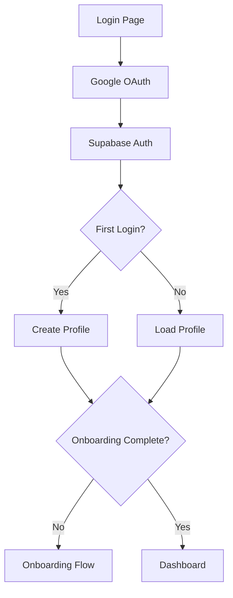

# 🏗️ Arquitetura Técnica - Smart Digital Menu

## 📐 Visão Geral da Arquitetura

### Padrões Aplicados

1. **Clean Architecture**
   - Separação clara entre UI, lógica de negócio e dados
   - Dependências unidirecionais

2. **MVC Pattern (Adaptado para React/Next.js)**
   - **Model**: Supabase (PostgreSQL + Realtime)
   - **View**: React Components
   - **Controller**: Server Actions

3. **Feature-Based Organization**
   - Código organizado por funcionalidade, não por tipo de arquivo
   - Facilita manutenção e escalabilidade

---

## 📊 Camadas da Aplicação

### 1. Presentation Layer (UI)

```
components/
├── ui/           # Componentes base reutilizáveis
├── dashboard/    # Componentes do painel admin
├── public-menu/  # Componentes do menu público
├── providers/    # Context providers (Theme, i18n)
└── shared/       # Componentes compartilhados
```

**Responsabilidades:**
- Renderização de UI
- Interação do usuário
- Gestão de estado local
- Validação de formulários (client-side)

### 2. Business Logic Layer

```
app/actions/      # Server Actions (API layer)
├── auth.ts       # Autenticação
├── onboarding.ts # Setup inicial
├── categories.ts # Gestão de categorias
├── dishes.ts     # Gestão de pratos
├── tables.ts     # Gestão de mesas
└── orders.ts     # Sistema de pedidos
```

**Responsabilidades:**
- Validação de negócio
- Orquestração de operações
- Transformação de dados
- Autorização

### 3. Data Access Layer

```
lib/supabase/
├── client.ts     # Cliente browser
├── server.ts     # Cliente server-side
├── middleware.ts # Middleware de auth
└── types.ts      # Tipos TypeScript
```

**Responsabilidades:**
- Comunicação com banco de dados
- Realtime subscriptions
- Storage operations
- Auth flow

---

## 🔐 Segurança

### Row Level Security (RLS)

Todas as tabelas implementam RLS com políticas específicas:

```sql
-- Exemplo: Donos só acessam seus restaurantes
CREATE POLICY "Owners can manage their restaurants" 
ON restaurants
FOR ALL 
USING (auth.uid() = owner_id);

-- Público pode ver restaurantes ativos
CREATE POLICY "Public can view active restaurants" 
ON restaurants
FOR SELECT 
USING (is_active = true);
```

### Fluxo de Autenticação



### Middleware Protection

```typescript
// middleware.ts
export async function middleware(request: NextRequest) {
  // Verifica autenticação em todas as rotas protegidas
  // Redireciona para /login se não autenticado
}
```

---

## 📡 Comunicação em Tempo Real

### Supabase Realtime

**Implementação:**

```typescript
// Kitchen Dashboard
const channel = supabase
  .channel('kitchen-orders')
  .on('postgres_changes', {
    event: '*',
    schema: 'public',
    table: 'orders',
  }, () => {
    loadOrders() // Atualiza UI
  })
  .subscribe()
```

**Casos de Uso:**
- ✅ Novos pedidos aparecem na cozinha instantaneamente
- ✅ Mudanças de status sincronizam todos os dashboards
- ✅ Garçom recebe notificação quando pedido fica pronto

---

## 🗄️ Modelo de Dados

### Principais Relacionamentos

```
profiles (1) ─────┬───── (N) restaurants
                  │
restaurants (1) ──┼───── (N) categories
                  │───── (N) dishes
                  │───── (N) ingredients
                  │───── (N) tables
                  └───── (N) orders

dishes (N) ───────────── (N) ingredients
       │                  (via dish_ingredients)
       └────────────────── (N) dish_images

orders (1) ─────┬──────── (N) order_items
                └──────── (N) order_status_history

order_items (N) ───────── (N) order_item_ingredients
```

### JSONB para i18n

Todos os conteúdos traduzíveis usam JSONB:

```json
{
  "pt-BR": "Hambúrguer",
  "en": "Burger",
  "es": "Hamburguesa",
  "zh": "汉堡",
  "ja": "ハンバーガー"
}
```

**Vantagens:**
- Consultas eficientes
- Suporte nativo PostgreSQL
- Fácil expansão para novos idiomas

---

## 🎨 Sistema de Temas

### CSS Variables Dinâmicas

```css
:root {
  --primary-color: #FF6B6B;
  --primary-color-dark: #E85555;
  --primary-color-light: #FF8888;
}

[data-theme='blue'] {
  --primary-color: #4299E1;
  --primary-color-dark: #3182CE;
  --primary-color-light: #63B3ED;
}
```

**Aplicação:**

```typescript
// No onboarding, ao salvar:
setThemeColor(colorKey) // 'red', 'blue', etc.

// CSS aplica automaticamente:
document.documentElement.setAttribute('data-theme', colorKey)
```

---

## 🌍 Internacionalização (i18n)

### Arquitetura

```
i18n/
├── locales/
│   ├── pt-BR.json
│   ├── en.json
│   ├── es.json
│   ├── zh.json
│   └── ja.json
└── config.ts
```

### Context Provider

```typescript
const { t, locale, setLocale } = useTranslation()

// Uso:
t('menu.addDish')           // "Adicionar Prato"
t('validation.minValue', { min: 10 }) // "Valor mínimo: 10"
```

---

## 📤 Upload de Arquivos

### Fluxo de Upload

```typescript
// 1. Cliente seleciona arquivo
// 2. Valida tipo e tamanho
// 3. Comprime imagem (opcional)
// 4. Envia para Supabase Storage
// 5. Recebe URL pública
// 6. Salva URL no banco de dados
```

### Storage Buckets

| Bucket | Tipo | Uso |
|--------|------|-----|
| `restaurant-logos` | Público | Logos dos restaurantes |
| `restaurant-covers` | Público | Capas dos perfis |
| `dish-images` | Público | Fotos dos pratos |
| `qr-codes` | Público | QR codes gerados |

---

## 🔄 Sistema de Pedidos

### Estados do Pedido

```typescript
type OrderStatus = 
  | 'pending'        // Cliente fez pedido
  | 'received'       // Cozinha aceitou
  | 'in_preparation' // Está sendo preparado
  | 'ready'          // Pronto para entrega
  | 'delivered'      // Entregue ao cliente
  | 'cancelled'      // Cancelado
```

### Fluxo Completo

```
Cliente (Menu Público)
  └─> Cria pedido → 'pending'
        │
        ↓
Cozinha Dashboard
  └─> Aceita → 'received'
  └─> Prepara → 'in_preparation'
  └─> Finaliza → 'ready'
        │
        ↓
Garçom Dashboard
  └─> Entrega → 'delivered'
```

---

## ⚡ Performance

### Server Components (Next.js 15)

- Páginas renderizadas no servidor por padrão
- Reduz JavaScript no cliente
- Melhor SEO e tempo de carregamento inicial

### Client Components

Usado apenas quando necessário:
- Interatividade (onClick, onChange)
- Hooks de estado (useState, useEffect)
- Context consumers

### Optimistic Updates

```typescript
// Atualiza UI imediatamente, sincroniza depois
const handleStatusChange = async (orderId, newStatus) => {
  // 1. Atualiza estado local
  setOrders(prev => prev.map(o => 
    o.id === orderId ? { ...o, status: newStatus } : o
  ))
  
  // 2. Sincroniza com servidor
  await updateOrderStatus(orderId, newStatus)
}
```

---

## 🧪 Validação

### Client-Side (Imediata)

```typescript
// Zod schemas para validação estrutural
const dishSchema = z.object({
  name: z.string().min(3),
  basePrice: z.number().min(0),
})
```

### Server-Side (Segura)

```typescript
// Server Actions sempre revalidam
export async function createDish(data: DishInput) {
  // 1. Valida dados
  if (!data.name || data.basePrice < 0) {
    return { success: false, error: 'Invalid input' }
  }
  
  // 2. Verifica autorização
  const user = await getCurrentUser()
  if (!user) {
    return { success: false, error: 'Unauthorized' }
  }
  
  // 3. Executa operação
  const result = await supabase.from('dishes').insert(...)
  
  return { success: true, data: result }
}
```

---

## 🚀 Deploy

### Recomendações

**Vercel (Ideal para Next.js):**
```bash
npm install -g vercel
vercel
```

**Configurações:**
- Framework: Next.js
- Build Command: `npm run build`
- Output Directory: `.next`

**Variáveis de Ambiente:**
```env
NEXT_PUBLIC_SUPABASE_URL=...
NEXT_PUBLIC_SUPABASE_ANON_KEY=...
NEXT_PUBLIC_APP_URL=https://seu-dominio.com
```

---

## 📈 Escalabilidade

### Pontos de Extensão

1. **Mais Idiomas**: Adicionar arquivo JSON em `i18n/locales/`
2. **Novas Cores**: Adicionar variáveis em `globals.css`
3. **Novos Status**: Atualizar enum no banco + constantes
4. **Analytics**: Adicionar tracking em Server Actions
5. **Notificações**: Integrar com serviço de push

### Limites Atuais

- Supabase Free Tier: 500MB DB, 1GB Storage
- Para produção: Considerar plano Pro

---

## 🔍 Monitoramento

### Logs Importantes

```typescript
// Em Server Actions
console.error('Error creating order:', error)

// Em Realtime
console.log('Subscribed to channel:', channelName)
```

### Métricas Sugeridas

- Tempo médio de preparo de pedidos
- Taxa de conversão (visualizações → pedidos)
- Pratos mais pedidos
- Horários de pico

---

## 📚 Dependências Principais

| Pacote | Versão | Uso |
|--------|--------|-----|
| Next.js | 15.x | Framework React |
| React | 19.x | UI Library |
| Supabase | 2.x | Backend as a Service |
| Tailwind CSS | 3.x | Estilização |
| TypeScript | 5.x | Type Safety |
| qrcode | 1.5.x | Geração de QR codes |
| react-icons | 5.x | Ícones |

---

## 🎯 Decisões Arquiteturais

### Por que Next.js App Router?

✅ Server Components por padrão
✅ Nested layouts
✅ Server Actions (API simplificada)
✅ Streaming e Suspense
✅ File-based routing

### Por que Supabase?

✅ PostgreSQL robusto
✅ RLS built-in
✅ Realtime nativo
✅ Storage integrado
✅ Auth completo
✅ Free tier generoso

### Por que TypeScript?

✅ Type safety
✅ IntelliSense
✅ Refactoring seguro
✅ Documentação implícita

---

**Arquitetura projetada para escalabilidade, manutenibilidade e performance** 🚀
